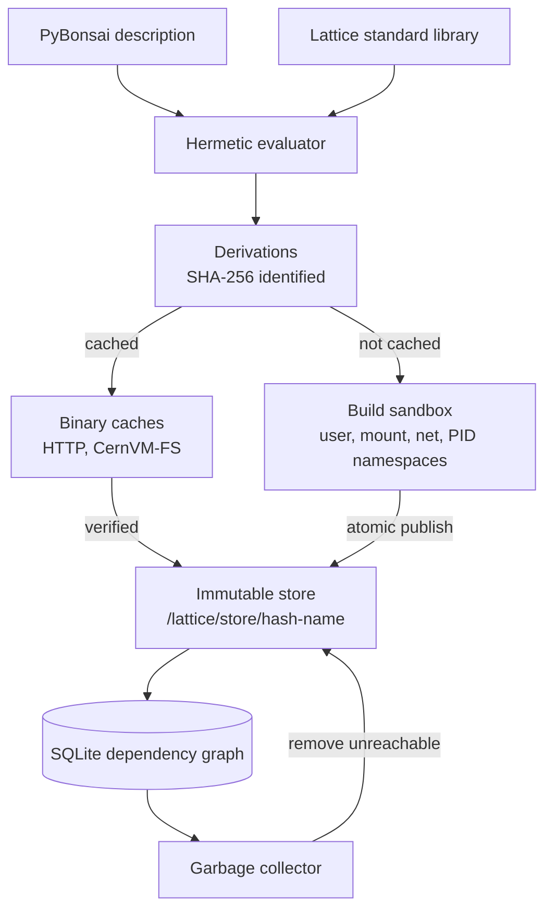

# PyrixOS

PyrixOS is a reproducible, declarative Linux distribution. The whole system, from one package to a complete machine, is described in PyBonsai, a restricted subset of Python, and built by the Lattice package manager. The same description always produces the same system, every build runs in isolation, and nothing is ever changed in place.

Declarative distributions such as NixOS and Guix System already offer these guarantees, but each asks the user to learn a dedicated language first. PyrixOS keeps Python syntax and removes the parts of Python that would let a result depend on anything other than its description.



## Components

| Component | Role |
| --- | --- |
| PyBonsai | The configuration language. Python 3.12 syntax interpreted from its syntax tree, never executed. Python builtins are not in scope and only allow-listed attributes can be read. No imports, I/O, `while` loops, mutation, recursion or dunder access, so evaluating a configuration file always finishes, never runs forever, and gives the same result on every machine. |
| Lattice | The package manager. Evaluates PyBonsai into derivations, drives builds, publishes results and collects garbage. Written in Python with no external container or build tools. |
| Derivations | Exact build recipes giving name, builder, arguments, environment and outputs, identified by the SHA-256 hash of their canonical form. |
| Build sandbox | Fresh Linux user, mount, network and PID namespaces for every build, created directly with `unshare(2)`. No network, and only declared inputs visible, mounted read-only. |
| Immutable store | Each build result lives at `/lattice/store/<hash>-<name>`. It is published with an atomic rename and made read-only. |
| Dependency database | An SQLite graph of store paths, run-time references and garbage collection roots. |
| Profiles and stacks | Profiles select what is active through atomic generations that can be rolled back. Several versions of a large stack, such as an NVIDIA HPC stack, can be installed together while a slot keeps exactly one active. |
| Binary caches | Prebuilt store paths are fetched from signed caches instead of being built. An HTTP cache serves every package, and a CernVM-FS repository serves large stacks as shallow paths that are fetched file by file on first use. |
| Garbage collector | Marks everything reachable from a root and removes the rest, without ever deleting a path that is still needed. |

## Status

PyrixOS is at the design stage and there is nothing to install yet. The architecture is proposed in RFC 0001, which is open for comment, and implementation begins once it is accepted. The [development plan](development-plan.md) lists the phases.

## Documentation

The documentation site is published at <https://www.packetfive.com/pyrixos/docs/> and is built from this repository with MkDocs Material.

```sh
python3 -m venv .venv
. .venv/bin/activate
pip install -r requirements-docs.txt
mkdocs serve
```

`mkdocs build --strict` writes the site to `site/`.

## Contributing

Design changes are proposed as RFCs, and comments on a draft RFC are made through issues on this repository.

AI-assisted contributions follow the [Linux Kernel AI Coding Assistants Policy](https://docs.kernel.org/process/coding-assistants.html). AI tools must not add `Signed-off-by:` or `Co-authored-by:` trailers. An AI-assisted commit carries an `Assisted-by: AGENT_NAME:MODEL_NAME` trailer giving the model family only, a `Reviewed-by:` trailer for the human reviewer and the submitter's own `Signed-off-by:`.
