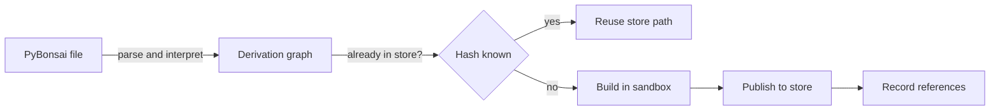

# Lattice package manager

Draft
Defined in <strong>RFC 0001 §5, §7, §13, §14</strong>
Implementation <strong>Pure Python</strong>

Lattice is the package manager at the centre of PyrixOS. It takes a PyBonsai description and carries it all the way to installed software. It evaluates the description, turns it into derivations, builds each derivation in a sandbox, publishes the results to the store, and later removes what is no longer needed. Lattice is written in Python and depends only on the Python standard library and the Linux kernel. It needs no container runtime, daemon or external build tool.

## From description to store

Lattice works in stages and each one only consumes the output of the stage before it. The evaluator never builds, the sandbox never evaluates, and the store never runs build code. Because every derivation is identified by a hash of all its inputs, Lattice can see that a build has already been done and reuse its result without running it again.

## Derivations

A derivation is the exact recipe for one build. It names the package, the builder program and its arguments, the environment the builder sees, and the outputs it must produce. Any input that is itself a derivation, such as a source archive or a compiler, is part of the environment.

Lattice serialises each derivation to canonical JSON, with sorted keys, fixed encoding, and every input derivation replaced by its own hash. It then takes the SHA-256 digest of the result. That digest names the store path the build will produce. Changing anything that goes into a build, directly or several dependencies away, therefore produces a different hash and a different path, while identical recipes on different machines produce the same one.

## Standard library

The standard library is the only way a description reaches anything outside itself, and every function in it is pure.

| Function | Purpose |
| --- | --- |
| `derivation` | Creates a derivation from a name, builder, arguments, environment and outputs. |
| `fetch_url` | Declares a source by URL and expected SHA-256. The download happens at build time, outside the sandbox, and fails if the hash does not match. |
| `len`, `range`, `sorted`, `min`, `max`, `str`, `int` | Pure helpers for working with immutable values. |

New functions are added only through an RFC.

## Measurement

Lattice times its own work so that the cost of each stage is visible. It records parse and evaluation time with the number of syntax tree nodes visited, sandbox setup and teardown time for every build, and the time taken and paths visited by each phase of garbage collection. Samples are held in memory and written out after the operation finishes, so timing never adds I/O to the work being timed. The metrics are listed in [RFC 0001 §14](../rfc/0001-pyrixos-architecture.md#14-measurement).
