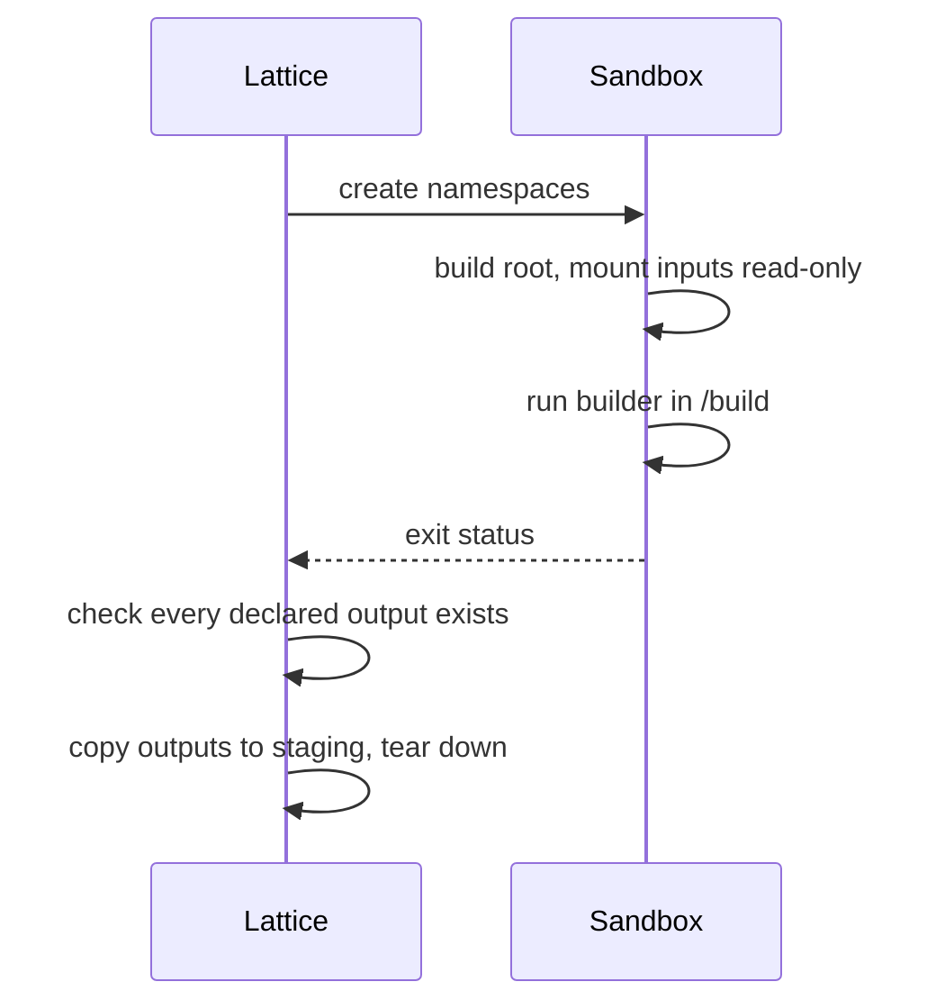

# Build sandbox

Draft
Defined in <strong>RFC 0001 §9</strong>
Mechanism <strong>unshare(2)</strong>

A reproducible description is only half of a reproducible build. The build itself must not be able to reach anything the description does not mention, such as a library that happens to be installed on the host, a file in a home directory, or a server on the network. Lattice prevents this by running every build in a fresh set of Linux namespaces that it creates itself through the `unshare(2)` system call. No Docker, Podman or Bubblewrap is involved.

## Isolation

| Namespace | What the build sees |
| --- | --- |
| User | It runs as root inside the sandbox, but only as the unprivileged Lattice user on the host. |
| Mount | Its own filesystem tree, which the host never sees and which disappears when the build ends. |
| Network | A loopback interface and nothing else. There is no route to any other machine. |
| PID | Its own process tree, in which the builder is PID 1. Host processes are invisible. |

## Filesystem

The root of the sandbox is an empty `tmpfs`. Lattice creates two writable directories in it, `/build` for the build to work in and `/out` for what it produces. The store paths of the build's declared inputs are mounted read-only at their usual locations, and a fresh `/proc` is mounted for the sandbox's own processes. Nothing else from the host is present, so a write anywhere outside `/build`, `/out` and the temporary root fails.

## One build, start to finish

When the builder exits, the kernel ends every process it started, because they all belong to the sandbox's PID namespace. Lattice checks that each output the derivation declared is present in `/out`. If one is missing or the builder failed, nothing is published.

## Host requirements

The sandbox needs unprivileged user namespaces, which most current Linux kernels provide. Some distributions restrict them by default, for example Ubuntu through the `kernel.apparmor_restrict_unprivileged_userns` setting. In that case Lattice reports the problem and refuses to build, rather than falling back to a build without isolation.

The full specification, including the order of system calls and why the builder needs a second `fork`, is in [RFC 0001 §9](../rfc/0001-pyrixos-architecture.md#9-build-sandbox).
