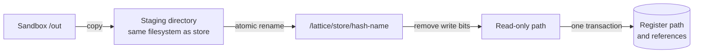
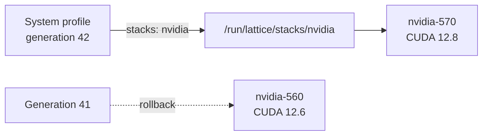
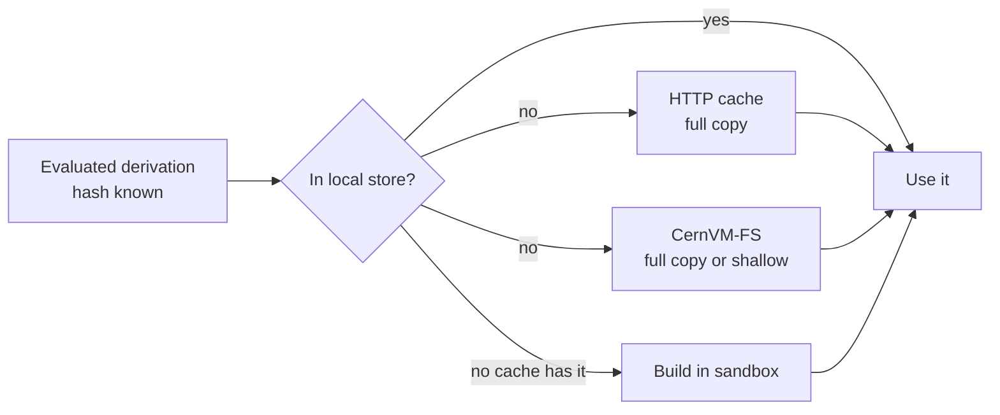

# Immutable store and garbage collector

Draft
Defined in <strong>RFC 0001 §9 to §13</strong>
Location <strong>/lattice/store</strong>

Everything Lattice builds is kept in the store, a single directory in which each entry is written once and never changed. Software is never upgraded in place. A new version is a new entry beside the old one, and the system switches from one to the other. Old entries stay until nothing needs them, and then the garbage collector removes them.

## Store paths

Each entry is a directory named `/lattice/store/<hash>-<name>`, for example `/lattice/store/3x9k…-hello-2.12.1`. The hash is the derivation hash, so it covers every input to the build. Two different builds can never claim the same path, and if a path already exists the build it represents has already been done.

## Publishing a build

A rename is atomic only within one filesystem, and the sandbox output lives in memory. Lattice therefore first copies the output to a staging directory on the same filesystem as the store, then moves it into place with a single rename. Anyone looking at the store sees either no entry or a complete one, never a partial one. Lattice then removes write permission from every file and directory in the entry, so any later attempt to change it fails with a permission error.

## Tracking dependencies

An SQLite database records every store path, every run-time dependency between paths, and the roots that must be kept, such as the current system and anything a user has pinned. Run-time dependencies are found by scanning a new entry's files for the hashes of the paths it was built from. A program linked against a library contains that library's store path, and so the dependency is found without being declared.

| Table | Holds |
| --- | --- |
| `store_paths` | One row per entry, with its derivation hash, a hash of its contents and its size |
| `references` | One row per dependency, from the entry that needs it to the entry it needs |
| `gc_roots` | The named entries that must never be collected |

Because an entry can only depend on entries that existed before it was built, these dependencies form a directed acyclic graph.

## Garbage collection

The collector works in two phases. It first marks every entry reachable from any root by following dependencies through the graph, using a recursive query inside SQLite so the graph does not have to be loaded into memory. It then sweeps, deleting every entry that was not marked, starting from those that depend on others so that no remaining record ever points at a deleted entry.

Store entries are read-only, so the collector restores write permission on each one immediately before deleting it. It removes the files first and the database record second, so an interrupted collection can at worst leave an unregistered directory behind for the next run to remove. Collection holds an exclusive lock on the store, so it never runs at the same time as a build that has not yet registered its result.

## Profiles and stack versions

The store activates nothing by itself. What a machine uses is decided by profiles. A profile is a sequence of generations, each one a complete environment in the store, and switching to a new generation or back to an old one is a single atomic rename. Every kept generation is a GC root.

Large software stacks, such as an NVIDIA HPC stack made of driver libraries, CUDA, cuDNN and NCCL, are combined into one stack per version. Any number of versions can sit in the store together, and each is assigned to a named slot such as `nvidia`. A slot is a single symlink at `/run/lattice/stacks/<slot>`, so exactly one version is active at a time.

Switching versions changes one line of the system description and switches the profile. When the kernel driver changes too, Lattice replaces the kernel modules only if no process has the GPU devices open. Otherwise the new version takes effect at the next boot. Running jobs keep the version they started with, and the garbage collector treats every store path a running process uses as a root, so an old stack is never deleted from under a job.

## Binary caches and shallow paths

Because a store path is named by its inputs, Lattice knows the name of every path before building it, and can first ask a binary cache whether a trusted machine has already built it. A cache is either a directory of static files served over HTTPS, holding a signed metadata file and a compressed archive per path, or a [CernVM-FS](https://cernvm.cern.ch/fs/) repository. Lattice accepts a path only with a signature from a key the machine trusts.

CernVM-FS fetches each file the first time it is opened and keeps it in a local cache of fixed size, and a file shared by two stack versions is stored once. Lattice can register a path from it as a shallow path, a symlink from the store into `/cvmfs`, so several versions of a stack of several gigabytes take almost no disk until they are used. This suits virtual machines and container images. Kernel modules are always copied locally, because they are needed at boot, and a shallow path can be turned into a full local copy before a machine goes offline.

The schema, locking rules, deletion order, activation steps and cache format are specified in [RFC 0001 §9 to §13](../rfc/0001-pyrixos-architecture.md#9-immutable-store).
