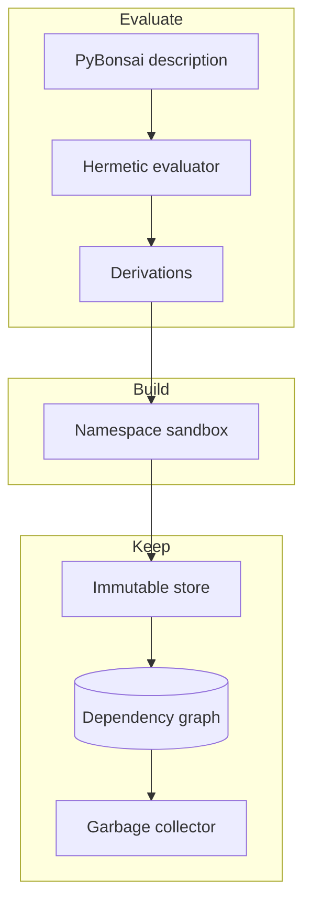

# Introduction to PyrixOS

Design stage
Specification <strong>RFC 0001</strong>
Language <strong>Python syntax</strong>

PyrixOS is a Linux distribution in which the whole system is described in code and built reproducibly. A package, a set of packages, or a complete machine is written as a short description in PyBonsai, a restricted form of Python. The Lattice package manager turns that description into exact build recipes, builds each one in isolation, and keeps the results in a store where nothing is ever changed in place.

The same description always produces the same system. Installing, upgrading and removing software means producing a new description and building it, while earlier builds stay in the store until nothing refers to them any more. Rolling back is a matter of pointing at an earlier result.

Configuration

PyBonsai

Python syntax, no side effects

Evaluation

Hermetic

Always terminates, always repeatable

Builds

Namespace sandbox

No network, no host filesystem

Results

Immutable store

Named by a hash of every input

Cleanup

Garbage collector

Removes only what nothing needs

## Why Python

Declarative distributions already exist. NixOS and Guix System build an entire operating system from a description and give the same guarantees PyrixOS aims for. Both ask the user to learn a dedicated language first, a lazy functional language in the case of Nix and Scheme in the case of Guix.

PyrixOS takes the same approach and changes the language. Many system administrators and developers already read and write Python, so PyBonsai keeps its syntax, its literals and its operators. What it removes are the parts of Python that make a result depend on something other than the description, such as imports, file and network access, mutation and loops that may never end. A PyBonsai file is never run as a Python program. Lattice reads its syntax tree and interprets only what the language allows.

## How the pieces fit

| Component | What it does |
| --- | --- |
| [PyBonsai](components/pybonsai.md) | The configuration language. Python syntax with a fixed allow list of constructs, single assignment and immutable values. |
| [Lattice package manager](components/lattice.md) | Evaluates PyBonsai, produces derivations identified by a SHA-256 hash, and drives builds, the store and collection. |
| [Build sandbox](components/sandbox.md) | Runs each build in fresh Linux user, mount, network and PID namespaces with no network access and only its inputs visible. |
| [Immutable store and garbage collector](components/store.md) | Publishes build outputs atomically as read-only paths, tracks their dependencies in SQLite, and removes paths no root can reach. |

## Project status

PyrixOS is at the design stage and there is nothing to install yet. The architecture is set out in [RFC 0001](rfc/0001-pyrixos-architecture.md), which is open for comment, and the [roadmap](roadmap.md) shows the order in which the components will be built once it is accepted.
