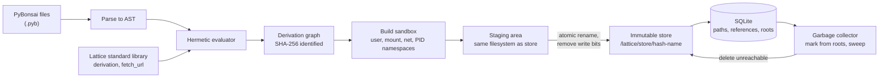
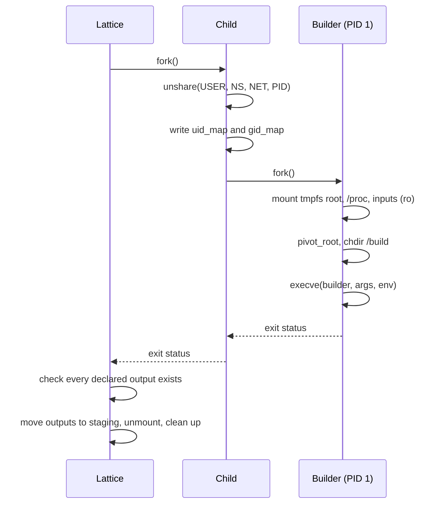

# RFC 0001 · PyrixOS Architecture

<div class="pyrix-meta" markdown>
<span class="pyrix-flag">Draft</span>
<span>RFC <strong>0001</strong></span>
<span>Created <strong>2026-10-07</strong></span>
<span>Scope <strong>Whole system</strong></span>
</div>

| Field | Value |
| --- | --- |
| Status | Draft, open for comment |
| Supersedes | None |
| Components | PyBonsai, Lattice evaluator, derivations, build sandbox, store, dependency database, garbage collector |

The key words MUST, MUST NOT, SHOULD, SHOULD NOT and MAY in this document are to be interpreted as described in [RFC 2119](https://www.rfc-editor.org/rfc/rfc2119) and [RFC 8174](https://www.rfc-editor.org/rfc/rfc8174) when, and only when, they appear in all capitals.

## 1. Summary

PyrixOS is a Linux distribution in which the entire system, from a single package to the full machine configuration, is described declaratively and built reproducibly. Descriptions are written in PyBonsai, a restricted subset of Python that has no side effects and always terminates. The Lattice package manager evaluates those descriptions into derivations, builds each derivation inside an isolated set of Linux namespaces with no network access, and places the result in an immutable store. An SQLite database records which store paths depend on which, and a garbage collector removes anything that is no longer reachable.

This RFC defines the architecture and the contract between those components. Implementation work follows acceptance of this RFC.

## 2. Motivation

Declarative package managers such as Nix and Guix have shown that a whole operating system can be built as a pure function of its description. The same inputs give the same system, upgrades are atomic, and a previous generation can always be restored. Adoption is limited by the configuration language. Nix uses its own lazy functional language, and Guix uses Scheme. Administrators who already know Python have to learn a new language and its idioms before they can change one package.

Plain Python cannot fill that role. It can read files, open sockets, read the clock, mutate shared state and loop forever, and any one of these makes evaluation depend on something other than its inputs. PyrixOS keeps Python syntax and removes those capabilities. A PyBonsai file is parsed and interpreted, never executed, and the interpreter accepts only constructs whose result depends on the file and its declared inputs alone.

## 3. Goals and non-goals

| Goals | Non-goals |
| --- | --- |
| Configuration written in a familiar Python syntax | Running arbitrary Python or third-party Python modules during evaluation |
| Evaluation that always terminates and is deterministic | General-purpose programming in the configuration language |
| Builds isolated from the network and from the host filesystem | Container image distribution or a container runtime |
| An immutable store where every path is named by a hash of its inputs | Binary-compatible reuse of the Nix store or Nix expressions |
| Garbage collection that never removes a path reachable from a root | Distributed or remote builds in this RFC |
| Built-in timing for evaluation, sandbox and garbage collection | Performance targets; this RFC defines what is measured, not the thresholds |
| A pure Python implementation with no external container tools | |

## 4. Terminology

PyBonsai
:   The configuration language. A subset of Python syntax with the semantics defined in section 6.

Evaluator
:   The part of Lattice that parses a PyBonsai file and interprets its syntax tree.

Derivation
:   A complete, immutable description of one build: its name, builder, arguments, environment and named outputs. Defined in section 7.

Realisation
:   Running a derivation's build and registering its outputs in the store.

Store path
:   A directory under `/lattice/store` named `<hash>-<name>`, where `<hash>` is the derivation hash. Store paths never change after registration.

Reference
:   A directed edge from one store path to another store path that it needs at run time.

GC root
:   A store path that MUST be kept, such as the current system generation or a path a user has pinned.

## 5. Architecture overview



Each stage only consumes the output of the stage before it. The evaluator never builds anything, the sandbox never evaluates PyBonsai, and the store never runs build code. That separation lets each stage be tested, measured and reasoned about on its own.

## 6. PyBonsai language

### 6.1 Evaluation model

A PyBonsai file MUST be parsed with Python's `ast.parse` and interpreted by walking the resulting tree. Lattice MUST NOT pass PyBonsai source, or any part of it, to `eval`, `exec`, `compile` or `importlib`. Any node type not listed in section 6.2 MUST be rejected with a `SyntaxError` that names the node type, file, line and column. Rejection happens before any part of the file is evaluated, so a file either evaluates completely or not at all.

The only names visible to a file are the names it assigns and the names in the Lattice standard library (section 6.4). There are no Python builtins in scope.

### 6.2 Permitted constructs

| Construct | AST nodes | Rule |
| --- | --- | --- |
| Literals | `Constant`, `JoinedStr`, `FormattedValue` | Strings, numbers, booleans and `None`. f-strings MAY interpolate strings, numbers and derivations. |
| Collections | `Tuple`, `List`, `Dict`, `Set` | Lists become tuples, dictionaries become read-only mappings and sets become frozen sets at construction. |
| Names | `Name`, `Assign` | A name MAY be assigned exactly once in a scope. Targets MUST be plain names or tuple unpacking of plain names. |
| Operators | `BinOp`, `UnaryOp`, `BoolOp`, `Compare`, `IfExp` | Arithmetic, string concatenation, comparison and conditional expressions on immutable values. |
| Calls | `Call`, `keyword` | The callee MUST be a standard library function or a function defined in the same file. Arguments are passed by position or keyword; `*` and `**` unpacking are permitted on immutable collections. |
| Access | `Attribute`, `Subscript`, `Slice` | Attribute names MUST NOT begin with `__`. Subscripts index tuples, mappings and strings. |
| Comprehensions | `ListComp`, `DictComp`, `SetComp`, `comprehension` | The iterable MUST be finite and already evaluated. The result is immutable. |
| Loops | `For` | The iterable MUST be finite and already evaluated. Names bound in the loop are local to one iteration. |
| Functions | `FunctionDef`, `Return`, `Lambda`, `arguments` | Functions MAY be defined and called. Recursion is rejected (section 6.3). |

### 6.3 Rejected constructs

| Construct | AST nodes | Reason |
| --- | --- | --- |
| Unbounded loops | `While` | Evaluation could fail to terminate. |
| Imports | `Import`, `ImportFrom` | Would bring in code and capabilities outside the standard library. |
| Mutation | `AugAssign`, `AnnAssign`, `Delete`, `Global`, `Nonlocal`, and any second assignment to a name | Values would depend on evaluation order. |
| Dunder access | `Attribute` whose name starts with `__` | Opens a path to object internals, `__class__`, `__subclasses__` and from there to the host interpreter. |
| Exceptions and context | `Try`, `Raise`, `With`, `Assert` | Control flow that depends on failure, and resource handling that implies I/O. |
| Classes and async | `ClassDef`, `AsyncFunctionDef`, `Await`, `Yield`, `YieldFrom` | Mutable objects and suspended state. |
| Pattern matching and walrus | `Match`, `NamedExpr` | Assignment inside expressions bypasses the single assignment rule. |

Recursion MUST be rejected. The evaluator keeps the stack of user functions being called and fails if a function is entered while it is already on that stack. Together with the ban on `While` and the requirement that every iterable is finite, this guarantees that evaluation terminates.

### 6.4 Lattice standard library

The standard library is the only way a PyBonsai file reaches anything outside itself. Every function in it MUST be deterministic and free of side effects visible during evaluation.

| Function | Returns | Behaviour |
| --- | --- | --- |
| `derivation(name, builder, args, env, outputs)` | Derivation | Constructs a derivation as defined in section 7. |
| `fetch_url(url, sha256)` | Derivation | Declares a fixed-output source. No network access happens during evaluation. The download happens at realisation time, outside the build sandbox, and the result MUST match `sha256` or realisation fails. |
| `len`, `range`, `sorted`, `min`, `max`, `str`, `int` | Value | Pure helpers with the usual Python meaning, restricted to immutable values. `range` MUST be called with finite integer bounds. |

Additions to the standard library require an RFC.

### 6.5 Example

The following describes one package. The list and dictionary literals become a tuple and a read-only mapping when evaluated.

```python
src = fetch_url(
    url="https://ftp.gnu.org/gnu/hello/hello-2.12.1.tar.gz",
    sha256="<expected SHA-256 of the archive>",
)

hello = derivation(
    name="hello-2.12.1",
    builder="/bin/sh",
    args=["-c", "tar xf $src && cd hello-2.12.1 && ./configure --prefix=$out && make install"],
    env={"src": src},
    outputs=["out"],
)
```

## 7. Derivations

A derivation is an immutable record with the following fields.

| Field | Type | Meaning |
| --- | --- | --- |
| `name` | string | Human readable package name and version. Appears in the store path. |
| `builder` | string | Path, inside the sandbox, of the program that performs the build. |
| `args` | tuple of strings | Arguments passed to the builder. |
| `env` | mapping of string to string or derivation | Environment for the builder. A derivation value is replaced by its output store path at build time. |
| `outputs` | tuple of strings | Names of the outputs the build MUST produce, for example `out`, `dev` and `doc`. |

The derivation hash is the SHA-256 digest of a canonical serialisation of these fields. The canonical form MUST be JSON with keys sorted, no insignificant whitespace, UTF-8 encoding, and every derivation in `env` replaced by its own hash. Two derivations with the same fields therefore have the same hash on any machine, and changing any input, directly or through a dependency, changes the hash. The hash is written in lowercase base32 and truncated to 32 characters when used in a store path.

## 8. Build sandbox

### 8.1 Isolation

Each realisation runs in a fresh set of Linux namespaces created by Lattice itself through `unshare(2)`, using `os.unshare` on Python 3.12 or later or the `libc` symbol through `ctypes` on earlier versions. Lattice MUST NOT invoke Docker, Podman, Bubblewrap or any other container tool.

| Namespace | Flag | Effect on the build |
| --- | --- | --- |
| User | `CLONE_NEWUSER` | The build runs as root inside the namespace and as the unprivileged Lattice user outside it. |
| Mount | `CLONE_NEWNS` | Mounts made for the build are invisible to the host and disappear with the namespace. |
| Network | `CLONE_NEWNET` | The only interface is a loopback device, so the build has no route to any network. |
| PID | `CLONE_NEWPID` | The builder is PID 1 of its own process tree and cannot see or signal host processes. |

Unprivileged user namespaces MUST be available on the build host. Some distributions restrict them by default, for example through `kernel.apparmor_restrict_unprivileged_userns`, and Lattice MUST report that condition clearly instead of falling back to an unisolated build.

### 8.2 Filesystem

The sandbox root is a fresh `tmpfs`. Into it Lattice creates `/build` as the working directory and `/out` as the output directory, both writable, and bind-mounts the store paths of the derivation's inputs read-only at their usual `/lattice/store` locations. A fresh `/proc` is mounted for the new PID namespace. Nothing else from the host filesystem is visible. Every write outside `/build`, `/out` and the `tmpfs` itself fails.

### 8.3 Lifecycle



The second `fork` is required because `CLONE_NEWPID` affects only children created after the call. The builder therefore starts as PID 1 of the new namespace, and when it exits every process it started is killed by the kernel. If any declared output is missing, or the builder exits with a non-zero status, the realisation fails and nothing is registered.

## 9. Immutable store

### 9.1 Layout

Every store path is a direct child of `/lattice/store` named `<hash>-<name>`, where `<hash>` is the derivation hash from section 7 and `<name>` is the derivation name. Because the hash covers every input, two different builds can never claim the same path, and a path that already exists does not need to be built again.

### 9.2 Realisation

`rename(2)` is atomic only within one filesystem, and the sandbox output lives in a `tmpfs`. Lattice therefore copies each output from `/out` into a staging directory on the same filesystem as the store, for example `/lattice/staging`, and then publishes it with a single `os.rename` to its final path. A reader sees either no path or a complete path, never a partial one.

After the rename, Lattice MUST remove write permission recursively from the new path and everything below it, equivalent to `chmod -R a-w`, and then register it in the database inside the same transaction that records its references. An attempt to write into a registered store path MUST fail with `PermissionError`.

### 9.3 References

When a path is registered, Lattice scans its files for the hashes of the store paths in the derivation's inputs. Every input whose hash appears is recorded as a reference. This is the technique Nix uses, and it finds run-time dependencies such as shared libraries and interpreter paths without the package having to declare them.

## 10. Dependency database

The store is described by an SQLite database. Its schema is defined below.

| Table | Columns | Purpose |
| --- | --- | --- |
| `store_paths` | `id`, `path` (unique), `drv_hash`, `content_sha256`, `size`, `registered_at` | One row per registered store path, with a hash of its contents for later verification. |
| `references` | `referrer` (FK), `reference` (FK), primary key on both | One row per run-time dependency edge. |
| `gc_roots` | `name` (unique), `path` (FK), `created_at` | Named roots that the garbage collector MUST keep. |

`REFERENCES` is an SQL keyword, so the table name MUST be quoted in every statement. The edges in `references` form a directed acyclic graph, because a path can only refer to paths that existed before it was built. A path that contains its own hash does not record a reference to itself. Lattice MUST enable foreign keys and use write-ahead logging so that readers are not blocked during registration.

## 11. Garbage collector

Collection is mark and sweep over the reference graph. The mark phase starts from every path in `gc_roots` and follows `references` transitively, using a recursive common table expression inside SQLite so the traversal does not have to load the graph into Python. Every registered path not marked is unreachable.

The sweep phase deletes each unreachable path. Because store paths are read-only, Lattice MUST restore write permission on the path, and on directories inside it, immediately before deletion. Paths are swept in reverse dependency order, referrers before the paths they refer to, so no remaining row ever points at a deleted path. For each path Lattice removes the files, deletes the database rows for the path and its outgoing references, and commits. A path is removed from the database only after its files are gone, so an interrupted collection leaves at worst an unregistered directory that the next collection removes.

Collection and realisation MUST NOT overlap. Lattice holds an exclusive lock on the store for the whole of a collection, and realisation takes a shared lock, so a path being built cannot be collected before it is registered and rooted.

## 12. Measurement

Lattice records timing for its three main costs. Timers use `time.perf_counter_ns`, and samples are appended to an in-memory buffer that is written out once the operation completes, so measurement adds no I/O to the timed path.

| Metric | Unit | Recorded per |
| --- | --- | --- |
| Parse time | ms | File |
| Evaluation time and AST node count | ms, nodes | File, and derivation graph |
| Sandbox setup time, from `fork` to `execve` | ms | Realisation |
| Sandbox teardown time, from builder exit to cleanup | ms | Realisation |
| Mark time and paths visited | ms, paths | Collection |
| Sweep time and paths deleted | ms, paths | Collection |

Measurement MUST NOT change the result of any operation and MUST be possible to turn off.

## 13. Security considerations

The evaluator is the first line of defence and the sandbox is the second. A PyBonsai file is untrusted input, and the evaluator rejects everything outside a fixed allow list, rather than trying to block known escapes. The ban on dunder attributes closes the usual route from a Python object to the interpreter internals, and the absence of builtins removes `open`, `__import__` and `getattr`.

A build is also untrusted. It runs as an unprivileged user on the host, cannot reach the network, sees only its inputs and its own working directories, and cannot outlive its PID namespace. The one network operation, `fetch_url`, runs outside the sandbox and its result is accepted only if it matches the hash fixed in the configuration.

The store relies on file permissions for immutability. A process running as the Lattice user, or as root, can still restore write permission. Mounting the store read-only for every process except Lattice is left as an open question.

## 14. Alternatives considered

| Alternative | Why it is not the proposal |
| --- | --- |
| Nix language | A proven design, but a separate language is the adoption barrier PyrixOS exists to remove. |
| Starlark | A deterministic Python dialect from Bazel. Close in spirit, but it needs its own interpreter and differs from Python in places a user notices. PyBonsai uses the real Python parser, so any valid PyBonsai file is valid Python syntax. |
| Running Python with restricted builtins | Python sandboxes built by removing builtins have a long history of escapes. Interpreting an allow-listed AST is simpler to verify. |
| A container runtime for builds | Adds a large external dependency and a daemon. Namespaces are available directly from Python. |

## 15. Open questions

Bootstrap
:   How the first compiler, shell and core utilities enter the store so that builders such as `/bin/sh` exist inside the sandbox. This needs its own RFC.

For statements
:   A `for` statement cannot accumulate a result without rebinding a name, and comprehensions cover that need. Whether `for` stays in the language once comprehensions exist is open.

Output addressing
:   Store paths are named by the hash of their inputs. Naming them by the hash of their contents would let identical outputs from different inputs share a path.

Store protection
:   Whether the store should also be a read-only bind mount for all processes other than Lattice.

System configuration
:   How a full machine configuration, including services, users and boot, is expressed in PyBonsai and activated. This needs its own RFC.
