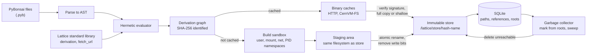
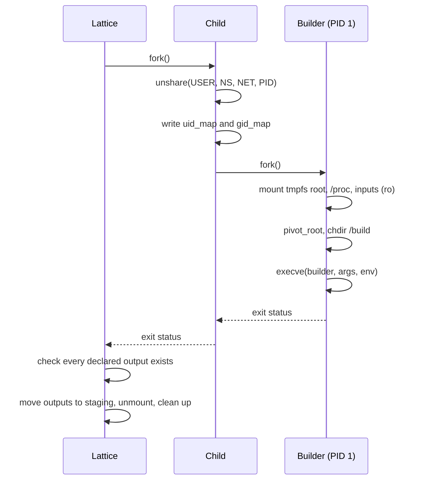

# RFC 0001 · PyrixOS Architecture

<div class="pyrix-meta" markdown>
<span class="pyrix-flag">Draft</span>
<span>RFC <strong>0001</strong></span>
<span>Created <strong>2026-10-07</strong></span>
<span>Scope <strong>Whole system</strong></span>
</div>

| Field | Value |
| --- | --- |
| Status | Draft, open for comment |
| Supersedes | None |
| Components | PyBonsai, Lattice evaluator, derivations, build sandbox, store, dependency database, garbage collector, profiles and stacks, binary caches |

The key words MUST, MUST NOT, SHOULD, SHOULD NOT and MAY in this document are to be interpreted as described in [RFC 2119](https://www.rfc-editor.org/rfc/rfc2119) and [RFC 8174](https://www.rfc-editor.org/rfc/rfc8174) when, and only when, they appear in all capitals.

## 1. Summary

PyrixOS is a Linux distribution in which the entire system, from a single package to the full machine configuration, is described declaratively and built reproducibly. Descriptions are written in PyBonsai, a restricted subset of Python. While Lattice evaluates a PyBonsai file, the file cannot read or write files, open network connections, read the clock or environment variables, or change a value after creating it. The result therefore depends only on the file and the inputs it declares, and is the same on every machine. PyBonsai also has no `while` loops and no recursion, so evaluating a file always finishes and can never run forever. The Lattice package manager evaluates those descriptions into derivations, builds each derivation inside an isolated set of Linux namespaces with no network access, and places the result in an immutable store. An SQLite database records which store paths depend on which, and a garbage collector removes anything that is no longer reachable. Profiles decide what is active, and stacks let several versions of a large software stack be installed together with exactly one in use.

This RFC defines the architecture and the contract between those components. Implementation work follows acceptance of this RFC.

## 2. Motivation

Declarative package managers such as Nix and Guix have shown that a whole operating system can be built as a pure function of its description. The same inputs give the same system, upgrades are atomic, and a previous generation can always be restored. Adoption is limited by the configuration language. Nix uses its own lazy functional language, and Guix uses Scheme. Administrators who already know Python have to learn a new language and its idioms before they can change one package.

Standard Python is imperative and allows side effects, which breaks reproducible builds. PyrixOS therefore implements PyBonsai as a restricted Python language evaluated by a hermetic AST evaluator. A PyBonsai file is parsed with `ast.parse` and its syntax tree is walked and interpreted, never executed with `eval` or `exec`. The evaluator accepts only an allow-listed set of constructs, bans unbounded loops, imports and dunder access, and makes every value immutable.

## 3. Goals and non-goals

| Goals | Non-goals |
| --- | --- |
| Configuration written in a familiar Python syntax | Running arbitrary Python or third-party Python modules during evaluation |
| Evaluation of a configuration file that always finishes and gives the same result on every machine | General-purpose programming in the configuration language |
| Builds isolated from the network and from the host filesystem | Container image distribution or a container runtime |
| An immutable store where every path is named by a hash of its inputs | Binary-compatible reuse of the Nix store or Nix expressions |
| Garbage collection that never removes a path reachable from a root | A cache server written for PyrixOS; caches are static files or CernVM-FS |
| Several versions of a software stack installed together, with exactly one active per slot | Several active versions of one stack on the same machine |
| Built-in timing for evaluation, sandbox and garbage collection | Performance targets; this RFC defines what is measured, not the thresholds |
| Prebuilt store paths fetched from signed caches, in full or on demand | Building derivations on remote machines |
| A pure Python implementation with no external container tools | |

## 4. Terminology

PyBonsai
:   The configuration language. A subset of Python syntax with the semantics defined in section 6.

Evaluator
:   The part of Lattice that parses a PyBonsai file and interprets its syntax tree.

Derivation
:   A complete, immutable description of one build: its name, builder, arguments, environment and named outputs. Defined in section 7.

Realisation
:   Running a derivation's build and registering its outputs in the store.

Store path
:   A directory under `/lattice/store` named `<hash>-<name>`, where `<hash>` is the derivation hash. Store paths never change after registration.

Reference
:   A directed edge from one store path to another store path that it needs at run time.

GC root
:   A store path that MUST be kept, such as the current system generation or a path a user has pinned.

Profile and generation
:   A profile is a named sequence of generations, and each generation is one environment in the store. One generation of each profile is current. Defined in section 12.1.

Stack and slot
:   A stack is a set of packages combined into one derivation. A slot is a named place where exactly one stack is active. Defined in section 12.2.

Substitution and binary cache
:   Substitution is fetching a store path that someone else has built instead of building it. A binary cache is a signed collection of store paths that machines substitute from. Defined in section 13.

Shallow path
:   A store path registered as a symlink into a mounted CernVM-FS repository. Its files are fetched when first opened. Defined in section 13.5.

## 5. Architecture overview



Each stage only consumes the output of the stage before it. The evaluator never builds anything, the sandbox never evaluates PyBonsai, and the store never runs build code. That separation lets each stage be tested, measured and reasoned about on its own.

## 6. PyBonsai language

### 6.1 Python baseline

Lattice targets CPython 3.12. It is the first release that provides `os.unshare`, which the build sandbox uses directly (section 8.1), and its `ast` module defines the node names used throughout this section. PyBonsai files MUST be parsed with `ast.parse(source, mode="exec", feature_version=(3, 12))`, so the accepted grammar stays the same when Lattice runs on a later interpreter. `feature_version` is best effort in CPython, so the allow list in section 6.3 is the actual guarantee. Any node type added in a later Python release is not on that list and is rejected. Moving the baseline to a later Python release requires an amendment to this RFC that reviews the new node types, builtins and methods of that release.

### 6.2 Evaluation model

A PyBonsai file MUST be parsed as described in section 6.1 and interpreted by walking the resulting tree. Lattice MUST NOT pass PyBonsai source, or any part of it, to `eval`, `exec`, `compile` or `importlib`. Any node type not listed in section 6.3 MUST be rejected with a `SyntaxError` that names the node type, file, line and column. Rejection happens before any part of the file is evaluated, so a file either evaluates completely or not at all.

The only names visible to a file are the names it assigns and the names in the Lattice standard library (section 6.6). The Python `builtins` module is not in scope, and section 6.5 lists what that removes.

### 6.3 Permitted constructs

| Construct | AST nodes | Rule |
| --- | --- | --- |
| Literals | `Constant`, `JoinedStr`, `FormattedValue` | `str`, `int`, `float`, `bool` and `None`. `bytes`, `complex` and `...` are rejected. f-strings MAY interpolate strings, numbers and derivations, and MUST NOT use a format spec or a `!r`/`!a` conversion. |
| Collections | `Tuple`, `List`, `Dict`, `Set` | Lists become tuples, dictionaries become read-only mappings and sets become frozen sets at construction. A dictionary literal that repeats a key MUST be rejected. Iterating or serialising a set MUST use sorted order, because string hashing is randomised per process and native set order differs between runs. |
| Names | `Name`, `Assign` | A name MAY be assigned exactly once in a scope. Targets MUST be plain names or tuple unpacking of plain names. |
| Operators | `BinOp`, `UnaryOp`, `BoolOp`, `Compare`, `IfExp` | Arithmetic, string concatenation, comparison and conditional expressions on immutable values. `%` string formatting is rejected for the same reason as `str.format`. |
| Calls | `Call`, `keyword`, `Starred` | The callee MUST be a standard library function or a function defined in the same file. Arguments are passed by position or keyword; `*` and `**` unpacking are permitted on immutable collections. |
| Access | `Attribute`, `Subscript`, `Slice` | Attribute names MUST be on the allow list in section 6.5. Subscripts index tuples, mappings and strings. |
| Comprehensions | `ListComp`, `DictComp`, `SetComp`, `comprehension` | The iterable MUST be finite and already evaluated. The result is immutable. |
| Loops | `For` | The iterable MUST be finite and already evaluated. Names bound in the loop are local to one iteration. |
| Functions | `FunctionDef`, `Return`, `Lambda`, `arguments` | Functions MAY be defined and called. Decorators and type parameters are rejected, and so is recursion (section 6.4). |

### 6.4 Rejected constructs

| Construct | AST nodes | Reason |
| --- | --- | --- |
| Unbounded loops | `While` | Evaluation could fail to terminate. |
| Imports | `Import`, `ImportFrom` | Would bring in code and capabilities outside the standard library. |
| Mutation | `AugAssign`, `AnnAssign`, `Delete`, `Global`, `Nonlocal`, and any second assignment to a name | Values would depend on evaluation order. |
| Unlisted attributes | `Attribute` whose name is not on the allow list in section 6.5, including every name that begins with `_` | Opens a path to object internals, such as `__class__`, `__subclasses__` and `__globals__`, and from there to the host interpreter. |
| Exceptions and context | `Try`, `TryStar`, `Raise`, `With`, `Assert` | Control flow that depends on failure, and resource handling that implies I/O. |
| Classes, generators and async | `ClassDef`, `GeneratorExp`, `Yield`, `YieldFrom`, `AsyncFunctionDef`, `AsyncFor`, `AsyncWith`, `Await` | Mutable objects and suspended state. Generator objects also expose frames through `gi_frame`. |
| Decorators | non-empty `decorator_list` on `FunctionDef` | A decorator replaces a function with the result of another call, which hides what is being called. |
| Type syntax added in Python 3.12 | `TypeAlias`, `TypeVar`, `ParamSpec`, `TypeVarTuple`, non-empty `type_params` | Has no meaning in a configuration and creates objects outside the value model. |
| Pattern matching and walrus | `Match`, `NamedExpr` | Assignment inside expressions bypasses the single assignment rule. |

Recursion MUST be rejected. The evaluator keeps the stack of user functions being called and fails if a function is entered while it is already on that stack. Together with the ban on `While` and the requirement that every iterable is finite, this guarantees that evaluation terminates. Section 6.7 bounds how much work it can do before it does.

### 6.5 Removed builtins, modules and methods

The evaluator works on an allow list. Nothing below is reachable from a PyBonsai file, and the table records why each group is excluded so that a later amendment does not add it back by accident.

| Group | Removed | Why |
| --- | --- | --- |
| Code execution | `eval`, `exec`, `compile`, `__import__`, `breakpoint` | Run code that the evaluator never inspects. |
| Reflection | `getattr`, `setattr`, `delattr`, `hasattr`, `globals`, `locals`, `vars`, `dir`, `type`, `isinstance`, `issubclass`, `callable`, `object`, `super` | Reach attributes by computed name, or reach type objects and from there interpreter internals. |
| Class machinery | `classmethod`, `staticmethod`, `property`, `__build_class__` | Only meaningful with classes, which are rejected. |
| I/O and interaction | `open`, `input`, `print`, `help`, `exit`, `quit` | Read or write outside the evaluation, or stop the process. |
| Non-deterministic | `hash`, `id` | `hash` of a string changes with `PYTHONHASHSEED` on every run, and `id` is a memory address. |
| Mutable and iterator types | `list`, `dict`, `set`, `bytearray`, `bytes`, `memoryview`, `iter`, `next`, `aiter`, `anext` | Create mutable values or stateful iterators. |
| String formatting | `format`, `str.format`, `str.format_map`, `%` on strings | Replacement fields such as `{0.__class__}` perform attribute access inside the string, where the evaluator cannot check it. f-strings are parsed into nodes and checked. |
| Modules | Every module, including `os`, `sys`, `subprocess`, `socket`, `pathlib`, `ctypes`, `importlib`, `time`, `datetime`, `random`, `uuid` and `secrets` | There is no import statement and no `__import__`, so no module is reachable. |

Attribute access is permitted only for the names in the following table. An attribute name that appears nowhere in the table is rejected when the file is checked, before evaluation. A listed name used on a value of a type it is not listed for fails during evaluation.

| Type | Permitted attributes |
| --- | --- |
| `str` | `lower`, `upper`, `strip`, `lstrip`, `rstrip`, `split`, `rsplit`, `splitlines`, `join`, `replace`, `startswith`, `endswith`, `removeprefix`, `removesuffix`, `partition`, `rpartition`, `count`, `find`, `isdigit`, `isalpha`, `isalnum` |
| `tuple` | `count`, `index` |
| read-only mapping | `get`, `keys`, `values`, `items`, each returning a tuple |
| frozen set | `union`, `intersection`, `difference`, `issubset`, `issuperset` |
| derivation | `name`, `builder`, `args`, `env`, `outputs`, `hash` |

### 6.6 Lattice standard library

The standard library is the only way a PyBonsai file reaches anything outside itself. Every function in it MUST return the same result for the same arguments, and MUST NOT read or change anything outside the evaluator while evaluation runs, such as files, the network or the clock.

| Function | Returns | Behaviour |
| --- | --- | --- |
| `derivation(name, builder, args, env, outputs)` | Derivation | Constructs a derivation as defined in section 7. |
| `fetch_url(url, sha256)` | Derivation | Declares a fixed-output source. No network access happens during evaluation. The download happens at realisation time, outside the build sandbox, and the result MUST match `sha256` or realisation fails. |
| `stack(slot, name, contents, kernel_modules)` | Derivation | Combines packages into one stack that can be assigned to the named slot (section 12.2). |
| `profile(name, packages, stacks)` | Derivation | Builds the environment for one profile generation. `stacks` maps each slot name to one stack (section 12.1). |
| `len`, `range`, `sorted`, `min`, `max`, `sum`, `any`, `all`, `abs`, `str`, `int`, `bool` | Value | Pure helpers with the usual Python meaning, restricted to immutable values. `range` MUST be called with finite integer bounds. |
| `enumerate`, `zip`, `reversed` | Tuple | As in Python, but the result is a fully evaluated tuple, not an iterator. |

Additions to the standard library require an RFC.

### 6.7 Evaluation limits

Termination alone does not bound cost. `10 ** 10 ** 8` terminates and still exhausts memory. Lattice MUST enforce limits on integer size in bits, string length, collection length, function call depth and the total number of nodes evaluated, and MUST fail evaluation with a clear error when one is exceeded. The limits are part of the Lattice release, not of the host, so the same file succeeds or fails identically on every machine. Lattice MUST NOT depend on host settings such as `sys.set_int_max_str_digits`.

### 6.8 Example

The following describes one package. The list and dictionary literals become a tuple and a read-only mapping when evaluated.

```python
src = fetch_url(
    url="https://ftp.gnu.org/gnu/hello/hello-2.12.1.tar.gz",
    sha256="<expected SHA-256 of the archive>",
)

hello = derivation(
    name="hello-2.12.1",
    builder="/bin/sh",
    args=["-c", "tar xf $src && cd hello-2.12.1 && ./configure --prefix=$out && make install"],
    env={"src": src},
    outputs=["out"],
)
```

## 7. Derivations

A derivation is an immutable record with the following fields.

| Field | Type | Meaning |
| --- | --- | --- |
| `name` | string | Human readable package name and version. Appears in the store path. |
| `builder` | string | Path, inside the sandbox, of the program that performs the build. |
| `args` | tuple of strings | Arguments passed to the builder. |
| `env` | mapping of string to string or derivation | Environment for the builder. A derivation value is replaced by its output store path at build time. |
| `outputs` | tuple of strings | Names of the outputs the build MUST produce, for example `out`, `dev` and `doc`. |

The derivation hash is the SHA-256 digest of a canonical serialisation of these fields. The canonical form MUST be JSON with keys sorted, no insignificant whitespace, UTF-8 encoding, and every derivation in `env` replaced by its own hash. Two derivations with the same fields therefore have the same hash on any machine, and changing any input, directly or through a dependency, changes the hash. The hash is written in lowercase base32 and truncated to 32 characters when used in a store path.

## 8. Build sandbox

### 8.1 Isolation

Each realisation runs in a fresh set of Linux namespaces created by Lattice itself through `unshare(2)`, using `os.unshare` from the Python 3.12 standard library. The `os` module has no wrappers for `mount(2)` and `pivot_root(2)`, so Lattice calls those through `ctypes` from `libc`. Lattice MUST NOT invoke Docker, Podman, Bubblewrap or any other container tool.

| Namespace | Flag | Effect on the build |
| --- | --- | --- |
| User | `CLONE_NEWUSER` | The build runs as root inside the namespace and as the unprivileged Lattice user outside it. |
| Mount | `CLONE_NEWNS` | Mounts made for the build are invisible to the host and disappear with the namespace. |
| Network | `CLONE_NEWNET` | The only interface is a loopback device, so the build has no route to any network. |
| PID | `CLONE_NEWPID` | The builder is PID 1 of its own process tree and cannot see or signal host processes. |

Unprivileged user namespaces MUST be available on the build host. Some distributions restrict them by default, for example through `kernel.apparmor_restrict_unprivileged_userns`, and Lattice MUST report that condition clearly instead of falling back to an unisolated build.

### 8.2 Filesystem

The sandbox root is a fresh `tmpfs`. Into it Lattice creates `/build` as the working directory and `/out` as the output directory, both writable, and bind-mounts the store paths of the derivation's inputs read-only at their usual `/lattice/store` locations. A fresh `/proc` is mounted for the new PID namespace. Nothing else from the host filesystem is visible. Every write outside `/build`, `/out` and the `tmpfs` itself fails.

### 8.3 Lifecycle



The second `fork` is required because `CLONE_NEWPID` affects only children created after the call. The builder therefore starts as PID 1 of the new namespace, and when it exits every process it started is killed by the kernel. If any declared output is missing, or the builder exits with a non-zero status, the realisation fails and nothing is registered.

## 9. Immutable store

### 9.1 Layout

Every store path is a direct child of `/lattice/store` named `<hash>-<name>`, where `<hash>` is the derivation hash from section 7 and `<name>` is the derivation name. Because the hash covers every input, two different builds can never claim the same path, and a path that already exists does not need to be built again.

### 9.2 Realisation

`rename(2)` is atomic only within one filesystem, and the sandbox output lives in a `tmpfs`. Lattice therefore copies each output from `/out` into a staging directory on the same filesystem as the store, for example `/lattice/staging`, and then publishes it with a single `os.rename` to its final path. A reader sees either no path or a complete path, never a partial one.

After the rename, Lattice MUST remove write permission recursively from the new path and everything below it, equivalent to `chmod -R a-w`, and then register it in the database inside the same transaction that records its references. An attempt to write into a registered store path MUST fail with `PermissionError`.

### 9.3 References

When a path is registered, Lattice scans its files for the hashes of the store paths in the derivation's inputs. Every input whose hash appears is recorded as a reference. This is the technique Nix uses, and it finds run-time dependencies such as shared libraries and interpreter paths without the package having to declare them.

## 10. Dependency database

The store is described by an SQLite database. Its schema is defined below.

| Table | Columns | Purpose |
| --- | --- | --- |
| `store_paths` | `id`, `path` (unique), `drv_hash`, `content_sha256`, `size`, `registered_at` | One row per registered store path, with a hash of its contents for later verification. |
| `references` | `referrer` (FK), `reference` (FK), primary key on both | One row per run-time dependency edge. |
| `gc_roots` | `name` (unique), `path` (FK), `created_at` | Named roots that the garbage collector MUST keep. |

`REFERENCES` is an SQL keyword, so the table name MUST be quoted in every statement. The edges in `references` form a directed acyclic graph, because a path can only refer to paths that existed before it was built. A path that contains its own hash does not record a reference to itself. Lattice MUST enable foreign keys and use write-ahead logging so that readers are not blocked during registration. Section 13.8 adds two columns to `store_paths` for paths fetched from a cache.

## 11. Garbage collector

Collection is mark and sweep over the reference graph. The mark phase starts from every path in `gc_roots` and follows `references` transitively, using a recursive common table expression inside SQLite so the traversal does not have to load the graph into Python. Every registered path not marked is unreachable. Section 12.5 adds the temporary roots held by running processes.

The sweep phase deletes each unreachable path. Because store paths are read-only, Lattice MUST restore write permission on the path, and on directories inside it, immediately before deletion. Paths are swept in reverse dependency order, referrers before the paths they refer to, so no remaining row ever points at a deleted path. For each path Lattice removes the files, deletes the database rows for the path and its outgoing references, and commits. A path is removed from the database only after its files are gone, so an interrupted collection leaves at worst an unregistered directory that the next collection removes.

Collection and realisation MUST NOT overlap. Lattice holds an exclusive lock on the store for the whole of a collection, and realisation takes a shared lock, so a path being built cannot be collected before it is registered and rooted.

## 12. Profiles, generations and exclusive stacks

The store holds every version of everything that has been built, side by side, and activates nothing by itself. What a machine actually uses is decided by profiles. This section also defines stacks, which let several versions of a large software stack, such as an NVIDIA HPC stack, be installed at once while exactly one of them is active.

### 12.1 Profiles and generations

A profile is a named sequence of generations under `/lattice/profiles/<profile>`. Each generation is a symlink `<profile>-<n>` to one store path, the environment that combines everything the profile provides. The symlink `<profile>` points at the current generation. Every generation is registered as a GC root named `profile/<profile>/<n>`, so nothing a generation uses can be collected.

Lattice switches a profile by building the new environment, creating the symlink for generation `n + 1`, and then replacing the `<profile>` symlink by creating a temporary symlink and renaming it over the old one. The rename is atomic, so the profile always points at a complete generation. Rolling back is a switch to an earlier generation. Generations are removed only by an explicit command, for example one that keeps the last N, and only then can the garbage collector reclaim what they used.

### 12.2 Stacks and slots

A stack is a single derivation that combines a set of packages released and tested together, created with the standard library function `stack`. An NVIDIA stack, for example, combines the driver user-space libraries, the CUDA toolkit, cuDNN and NCCL, and names the kernel modules it needs. Because a stack is a derivation, each version has its own hash and store path, and any number of versions can be in the store at once.

A slot is a named place where exactly one stack is active. It is a symlink `/run/lattice/stacks/<slot>` to the store path of the active stack. A symlink has one target, so two versions cannot be active in the same slot at once. The configuration enforces the same rule before anything is built. A profile maps each slot name to one stack, and the evaluator MUST reject a dictionary literal that repeats a key, which plain Python would accept silently by keeping the last value.

```python
nvidia_560 = stack(
    slot="nvidia",
    name="nvidia-560",
    contents=[nvidia_driver_560, cuda_12_6, cudnn_9, nccl_2],
    kernel_modules=[nvidia_kmod_560],
)

nvidia_570 = stack(
    slot="nvidia",
    name="nvidia-570",
    contents=[nvidia_driver_570, cuda_12_8, cudnn_9, nccl_2],
    kernel_modules=[nvidia_kmod_570],
)

system = profile(
    name="system",
    packages=[slurm, openmpi],
    stacks={"nvidia": nvidia_570},
)
```

Both stacks are built and kept. Only `nvidia_570` is active, because it is the one the `system` profile assigns to the `nvidia` slot. Activating `nvidia_560` means changing that one line and switching the profile.

### 12.3 Activation

Switching slot `S` from stack `A` to stack `B` is a privileged operation, unlike building, because it may load kernel modules. Lattice MUST perform it in the following order.

1. Realise `B` and create the new profile generation. Nothing active has changed yet.
2. If the kernel modules of `A` and `B` have the same hashes, go to step 5.
3. Check that the modules of `B` were built for the running kernel, that no process holds the device files of `A` open, found by scanning `/proc/<pid>/fd`, and that the modules of `A` have a reference count of zero.
4. Unload the modules of `A` in reverse dependency order and load the modules of `B` from its store path. If any part fails, reload the modules of `A`, leave the slot and the profile unchanged, and report the failure.
5. Replace the slot symlink with a temporary symlink and a rename.
6. Make the new generation current by renaming the profile symlink.

If step 3 finds the device in use, Lattice MUST NOT force the change. It makes the new generation the one to boot into and leaves the running system unchanged. At boot, slots are created from the current generation before any service starts, so a machine always comes up with the slots its current generation describes, including after a crash between steps 5 and 6.

### 12.4 Using an active stack

Packages built by Lattice refer to their dependencies by exact store path and are not affected by slots. A program built against CUDA 12.6 keeps using CUDA 12.6 whichever stack is active. Slots serve everything that finds a stack at a stable path, such as user jobs, the job scheduler and software built outside PyrixOS. The system profile puts `/run/lattice/stacks/<slot>/bin` on `PATH` and `/run/lattice/stacks/<slot>/lib` in the dynamic loader configuration.

Driver user-space libraries that must match the loaded kernel module, such as `libcuda.so` and `libnvidia-ml.so`, are the one exception. Packages MUST load them through the slot path and MUST NOT refer to them by store path, so they always match the module that is loaded.

A process resolves the slot symlink when it starts or loads a library, so running processes keep the version they started with and new processes get the new one. Because kernel modules change only while no process holds the device open, no running process ever sees a driver that does not match its libraries.

### 12.5 Collection

Every generation of every profile is a GC root, so a stack stays in the store for as long as any kept generation assigns it to a slot. In addition, while a collection runs, Lattice treats every store path that a running process uses as a temporary root. It finds these paths through `/proc/<pid>/exe`, `/proc/<pid>/cwd`, `/proc/<pid>/fd` and `/proc/<pid>/maps`. Removing an old generation therefore never deletes a stack that a running job is still using.

## 13. Binary caches and remote store paths

A store path is named by the hash of its inputs, so its name is known as soon as evaluation finishes and before anything is built. A machine can therefore ask whether someone it trusts has already built that path and fetch the result instead of building it. This is the mechanism Nix calls a binary cache. Lattice defines two kinds of cache that share the same hashes, metadata and signing keys.

| Cache | Transport | Fetch | Result in the local store | Intended for |
| --- | --- | --- | --- | --- |
| HTTP cache | Static files over HTTPS, from any web server or S3-compatible object store | Whole store path, before use | Full local copy | Every package |
| CernVM-FS cache | A [CernVM-FS](https://cernvm.cern.ch/fs/) repository mounted at `/cvmfs/<repo>` | Each file on first access, then cached | Full local copy or a shallow path | Large stacks, and machines with little disk |

### 13.1 Substitution

Before realising a derivation, Lattice checks whether its output is already registered in the local store. If it is not, Lattice asks each configured cache in order for the metadata of that store path. The first cache that returns metadata with a valid signature supplies the path. If no cache has it, Lattice builds it in the sandbox as in section 8. Fetching a path from a cache is called substitution, and the substituted path is registered exactly as if it had been built locally.

A path is substituted only after every path it refers to is present, so the store never holds a path whose references are missing. References of a substituted path are taken from its signed metadata and are not found by scanning, because the hashes in the metadata are what the signature covers.

### 13.2 Cache layout

An HTTP cache is a directory of static files, so no cache-specific server software is needed. For each store path `<hash>-<name>` it holds two files.

| File | Content |
| --- | --- |
| `<hash>.json` | The store path, derivation hash, the SHA-256 and size of the unpacked contents, the SHA-256, size and compression of the archive, the sorted list of references, the archive location and one or more signatures. |
| `archive/<archive-sha256>.tar.xz` | The store path as a tar archive, compressed with xz. |

The archive MUST be deterministic, so the same store path always yields the same bytes. Entries are sorted by path, modification times are set to zero, owner and group are set to `0` and empty names, and only the execute bit of each file's mode is kept. Archives are created and read with the Python `tarfile` and `lzma` modules. Zstandard compression MAY be added later as a second value of the compression field.

A file `lattice-cache.json` at the root of the cache states its format version and its priority, so that a machine with several caches can prefer a nearer one.

### 13.3 Signing and trust

Each cache entry is signed with an Ed25519 key. The signature covers a fingerprint made of the store path, the SHA-256 and size of the unpacked contents and the sorted references. It does not cover the archive, so the same signed entry is valid however the path is transported.

A machine lists the caches it uses and the public keys it trusts in its Lattice settings. Lattice MUST reject an entry that has no signature from a trusted key, and MUST check the SHA-256 of the archive and of the unpacked contents before registering a substituted path. Because store paths are named by their inputs and not their contents, a signature is a statement by the key holder that this content is the output of that derivation. Trusting a key therefore means trusting its holder's build machines. This RFC fixes the algorithm and the fingerprint, not the library used to compute them.

### 13.4 Publishing

A trusted build machine, normally continuous integration, realises derivations, signs each new path with the cache key and uploads the archive before the metadata. A reader that finds the metadata can always find the archive. Lattice provides `lattice push`, which publishes a store path and its whole closure, skipping paths the cache already holds.

### 13.5 CernVM-FS as a cache

CernVM-FS is a read-only, distributed filesystem used to distribute large HPC software stacks. It is published under the BSD-3-Clause licence, which is compatible with the GPL-2.0 licence of PyrixOS. A repository is mounted with FUSE at `/cvmfs/<repo>`. Files are fetched over HTTP the first time they are opened and kept in a local cache whose size is limited by `CVMFS_QUOTA_LIMIT`. When the limit is reached, the least recently used files are evicted. Files are stored by content hash, so a file that is identical in two versions of a stack is stored and fetched once. Every directory catalog is signed and every file is checked against its hash when it is fetched.

A Lattice CernVM-FS repository holds each published store path at `/cvmfs/<repo>/store/<hash>-<name>`, next to the same `<hash>.json` metadata that an HTTP cache holds. The publishing machine opens a transaction with `cvmfs_server transaction`, copies the store paths and their metadata into the repository and commits them with `cvmfs_server publish`. Paths are copied in reference order, so a published path never refers to one that is missing from the repository. One repository has one publisher at a time. Several build machines MAY publish through a CernVM-FS repository gateway, which leases a separate subdirectory to each.

A machine that mounts the repository can use a path from it in two ways.

Full copy
:   Lattice copies the path from `/cvmfs` into staging, checks it against the signed metadata and registers it, as for an HTTP cache. The repository is then a cache with per-file deduplication.

Shallow path
:   Lattice checks the signed metadata, creates `/lattice/store/<hash>-<name>` as a symlink to `/cvmfs/<repo>/store/<hash>-<name>` and registers it with the location `shallow`. Nothing is copied. Files are fetched only when a program opens them, and a stack of several gigabytes takes almost no disk space until it is used.

References inside a shallow path name other store paths by their `/lattice/store` path, so they resolve through the local store whether those paths are local or shallow. A slot that points at a shallow stack works as in section 12 without change.

### 13.6 Shallow path rules

The machine's Lattice settings list which slots and packages MAY be shallow. This choice is local to the machine and does not change any hash, so the same configuration can produce a full copy on one machine and a shallow path on another.

Kernel modules MUST always be local copies. They are loaded at boot, before the network and FUSE are available, and a module whose file is evicted from a cache cannot be reloaded. A stack MAY be shallow while the kernel modules it names are local.

CernVM-FS checks each file against its signed catalog when it is fetched, so Lattice does not hash the contents of a shallow path when it is registered, as that would fetch every file. `lattice verify` MAY be run on a shallow path, and it fetches and checks every file.

`lattice materialise <path>` turns a shallow path into a full copy, for example before a machine goes offline. Lattice copies the path into staging, checks it and, under the exclusive store lock, replaces the symlink with the directory. Between the removal of the symlink and the rename, a process that opens the path gets `ENOENT`, so Lattice SHOULD materialise a stack only while its slot is not active.

The garbage collector deletes only the symlink and the database rows of an unreachable shallow path. The files stay in the repository and in the CernVM-FS cache until they are evicted. A running process that uses a shallow path shows `/cvmfs/<repo>/store/<hash>-<name>` in `/proc/<pid>/maps`, so the scan in section 12.5 MUST map those paths back to their store paths.

### 13.7 Virtual machines and containers

A virtual machine mounts the repository with the CernVM-FS client like any other host. A container needs either `/dev/fuse` and the permission to mount it, or a bind mount of `/cvmfs` from the host. A bind mount from the host is preferred, because it lets every container on the host share one cache. An image built for a machine with no network access MUST hold full copies of every path it needs.

### 13.8 Database changes

Two columns are added to `store_paths`.

| Column | Values | Meaning |
| --- | --- | --- |
| `location` | `local`, `shallow` | Whether the path is a directory in the store or a symlink into a CernVM-FS repository. |
| `source` | Cache URL or repository name, or empty | Where the path was substituted from. Empty for a path built on this machine. |

For a shallow path, `content_sha256` and `size` are taken from the signed metadata.

## 14. Measurement

Lattice records timing for its three main costs. Timers use `time.perf_counter_ns`, and samples are appended to an in-memory buffer that is written out once the operation completes, so measurement adds no I/O to the timed path.

| Metric | Unit | Recorded per |
| --- | --- | --- |
| Parse time | ms | File |
| Evaluation time and AST node count | ms, nodes | File, and derivation graph |
| Sandbox setup time, from `fork` to `execve` | ms | Realisation |
| Sandbox teardown time, from builder exit to cleanup | ms | Realisation |
| Mark time and paths visited | ms, paths | Collection |
| Sweep time and paths deleted | ms, paths | Collection |
| Substitution time and bytes transferred | ms, bytes | Substituted path |
| Time to first open of a file in a shallow path | ms | Shallow path, first use |

Measurement MUST NOT change the result of any operation and MUST be possible to turn off.

## 15. Security considerations

The evaluator is the first line of defence and the sandbox is the second. A PyBonsai file is untrusted input, and the evaluator rejects everything outside a fixed allow list, rather than trying to block known escapes. The ban on dunder attributes closes the usual route from a Python object to the interpreter internals, and the absence of builtins removes `open`, `__import__` and `getattr`.

A build is also untrusted. It runs as an unprivileged user on the host, cannot reach the network, sees only its inputs and its own working directories, and cannot outlive its PID namespace. The one network operation, `fetch_url`, runs outside the sandbox and its result is accepted only if it matches the hash fixed in the configuration.

The store relies on file permissions for immutability. A process running as the Lattice user, or as root, can still restore write permission. Mounting the store read-only for every process except Lattice is left as an open question.

A substituted path is code that was built on another machine. Lattice accepts it only with a signature from a key the machine trusts, and checks its hashes before it is registered. A shallow path relies on the signed catalogs and per-file hashes of CernVM-FS for every file it later reads. The keys that sign a cache are as sensitive as the build machines that use them, and SHOULD be kept on those machines only.

## 16. Alternatives considered

| Alternative | Why it is not the proposal |
| --- | --- |
| Nix language | A proven design, but a separate language is the adoption barrier PyrixOS exists to remove. |
| Starlark | A deterministic Python dialect from Bazel. Close in spirit, but it needs its own interpreter and differs from Python in places a user notices. PyBonsai uses the real Python parser, so any valid PyBonsai file is valid Python syntax. |
| Running Python with restricted builtins | Python sandboxes built by removing builtins have a long history of escapes. Interpreting an allow-listed AST is simpler to verify. |
| A container runtime for builds | Adds a large external dependency and a daemon. Namespaces are available directly from Python. |
| A cache server written for PyrixOS | An HTTP cache is static files and CernVM-FS already provides lazy, verified, deduplicated distribution. Writing a server would add software to maintain without adding a capability. |
| Lazy OCI image formats such as Nydus or eStargz | They fetch file contents on demand, but are tied to container images and runtimes. Store paths are not container layers. |
| OSTree or casync | They deduplicate content well, but fetch a whole tree before it is used, which does not reduce disk use for a stack that is installed but idle. |

## 17. Open questions

Bootstrap
:   How the first compiler, shell and core utilities enter the store so that builders such as `/bin/sh` exist inside the sandbox. This needs its own RFC.

For statements
:   A `for` statement cannot accumulate a result without rebinding a name, and comprehensions cover that need. Whether `for` stays in the language once comprehensions exist is open.

Output addressing
:   Store paths are named by the hash of their inputs. Naming them by the hash of their contents would let identical outputs from different inputs share a path.

Store protection
:   Whether the store should also be a read-only bind mount for all processes other than Lattice.

System configuration
:   How services, users and boot are expressed in PyBonsai and activated. Profiles and stacks are covered in section 12, and the rest needs its own RFC.

Per-job slots
:   Whether a job may select its own stack in a private mount namespace instead of using the system-wide slot, as long as the kernel modules it needs are the ones loaded.

Settings format
:   Where a machine's caches, trusted keys and shallow path rules are declared, and whether they are PyBonsai or a separate settings file.

Shallow paths without FUSE
:   Whether a container that can neither use `/dev/fuse` nor bind mount `/cvmfs` from the host should fall back to full copies automatically.
